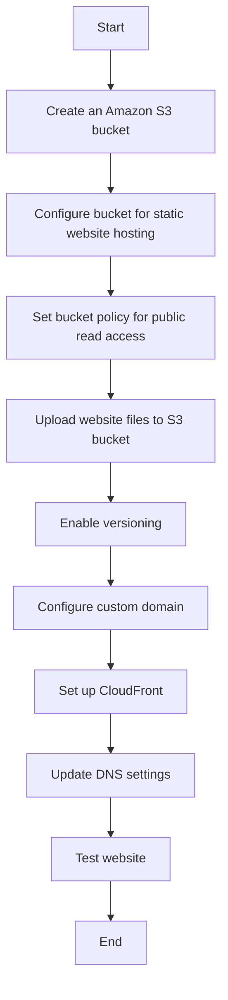

# AWS Host a Website on Amazon S3
## Let's host our very own website on Amazon S3!

### You can use Amazon S3 to store and retrieve any amount of data at any time from anywhere on the web. This is what we'll be creating today!

### This flowchart illustrates the main steps involved in hosting a website on Amazon S3. Here's a brief explanation of each step:
   - Create an Amazon S3 bucket: This is where your website files will be stored.
   - Configure bucket for static website hosting: Enable the static website hosting feature in your S3 bucket settings.
   - Set bucket policy for public read access: Modify the bucket policy to allow public read access to your website files.
   - Upload website files to S3 bucket: Transfer your HTML, CSS, JavaScript, and other assets to the S3 bucket.
   - Enable versioning: This is optional but recommended for maintaining different versions of your website.
   - Configure custom domain: Set up a custom domain name for your website if desired.
   - Set up CloudFront: Use Amazon CloudFront to create a content delivery network (CDN) for faster content delivery.
   - Update DNS settings: Point your domain to the CloudFront distribution or S3 website endpoint.
   - Test website: Ensure everything is working correctly.

