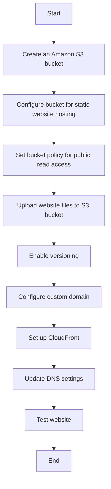

# AWS Host a Website on Amazon S3
## Let's host our very own website on Amazon S3!

### You can use Amazon S3 to store and retrieve any amount of data at any time from anywhere on the web. This is what we'll be creating today!

### This flowchart illustrates the main steps involved in hosting a website on Amazon S3. Here's a brief explanation of each step:
   1. Create an Amazon S3 bucket: This is where your website files will be stored.
      - Sign in to AWS, go to S3, and create a new bucket with a unique name.
   2. Configure bucket for static website hosting: Enable the static website hosting feature in your S3 bucket settings.
      - In the bucket properties, enable static website hosting and set index and error documents.
   3. Set bucket policy for public read access: Modify the bucket policy to allow public read access to your website files.
      - Edit the bucket policy to allow public read access to your files.
   4. Upload website files to S3 bucket: Transfer your HTML, CSS, JavaScript, and other assets to the S3 bucket.
      - Use the AWS console or CLI to upload your HTML, CSS, JS, and other assets.
   5. Enable versioning: This is optional but recommended for maintaining different versions of your website.
      - Turn on versioning in bucket properties to maintain file history.
   6. Configure custom domain: Set up a custom domain name for your website if desired.
       - If desired, purchase a domain and set up Amazon Route 53 to manage it.
   7. Set up CloudFront: Use Amazon CloudFront to create a content delivery network (CDN) for faster content delivery.
       - Create a CloudFront distribution pointing to your S3 bucket for faster content delivery.
   8. Update DNS settings: Point your domain to the CloudFront distribution or S3 website endpoint.
       - Configure your domain's DNS to point to the CloudFront distribution or S3 endpoint.
   9. Test website: Ensure everything is working correctly.
       - Access your website through the browser to ensure everything works correctly.

## Creating a Bucket - Step by Step
   1. 
      - Choose `Create bucket`.
      - `AWS Region` - select the region closest to you.
      - For `Bucket name`, enter `your-preferred-bucket-name`.
      > An S3 bucket name is globally unique, and all AWS accounts share the namespace. After you create a bucket, no other AWS account in the entire world can use your bucket's name unless you delete the bucket.
      
   2. 
      - For `Object Ownership`, choose `ACLs enabled`.
      -     An Access Control List (ACL) is a collection of rules that determines who can access a particular resource.
      -     By enabling ACLs in your S3 configuration, you can manage who has access to and what actions can be taken on the objects (such as website files) within your bucket.
      -     With ACLs, you can assign different AWS accounts ownership and control over specific files within the bucket.
      -     However, there’s a warning suggesting that using "bucket policies" might be simpler. Bucket policies allow you to set access permissions for the entire bucket at once (for instance, making all objects within it public), but they lack the detailed control over individual objects that ACLs provide.
      -     In summary, if your bucket contains no sensitive data, a bucket policy is sufficient. But if even a single object needs to remain private, using ACLs is the better option.
      - Choose `Bucket owner preferred`.
     
        
   3. 
      - For `Block Public Access settings for this bucket`, clear the check box for `Block all public access`.
      -     A yellow banner has popped up! This banner is telling us that the bucket and its objects might become public if we untick the checkbox. This is what we want to host a public website!
      - Tick the box  `“I acknowledge that the current settings might result in this bucket and the objects within becoming public.”`
   4. 
      - For `Bucket Versioning`, choose `Enable`.
        
   5. 
      - Choose `Create bucket`.
   6. 
       - Your bucket is created.

## Upload website content to your bucket
   1. In the `Buckets` section, choose the name of your new bucket.
   2. Choose `Upload`
      
      
      

