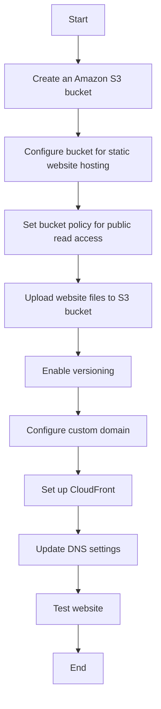

# Host a Website on Amazon S3

## Overview

This guide walks you through hosting a static website on Amazon S3. Amazon S3 allows you to store and retrieve any amount of data at any time from anywhere on the web.

## Process Flow

```mermaid
graph TD
    A[Start] --> B[Create an Amazon S3 bucket]
    B --> C[Configure bucket for static website hosting]
    C --> D[Set bucket policy for public read access]
    D --> E[Upload website files to S3 bucket]
    E --> F[Enable versioning]
    F --> G[Configure custom domain]
    G --> H[Set up CloudFront]
    H --> I[Update DNS settings]
    I --> J[Test website]
    J --> K[End]
```

## Implementation Steps

### 1. Create an Amazon S3 Bucket

#### Prerequisites
- An AWS account
- Website files ready for upload (HTML, CSS, JavaScript, etc.)

#### Bucket Creation Steps

1. Create a new bucket:
   
   - Choose `Create bucket`
   - `AWS Region` - select the region closest to you
   - For `Bucket name`, enter `your-preferred-bucket-name`
   > **Note**: S3 bucket names must be globally unique across all AWS accounts worldwide. Once you create a bucket, the name is reserved until you delete it.

2. Configure Object Ownership:
   
   - For `Object Ownership`, choose `ACLs enabled`
   - Choose `Bucket owner preferred`
   > **Important**: Access Control Lists (ACLs) allow fine-grained access control for individual objects, while bucket policies apply to the entire bucket.

3. Configure Public Access:
   
   - Clear the check box for `Block all public access`
   - Acknowledge the warning by checking the box
   > **Warning**: This step is necessary for hosting a public website, but ensure you understand the security implications.

4. Enable Versioning:
   
   - For `Bucket Versioning`, choose `Enable`

5. Create the bucket:
   
   - Choose `Create bucket`

6. Confirmation:
   
   - Your bucket is created successfully

### 2. Upload Website Content

1. Navigate to your bucket and upload files:
   
   
   

### 3. Configure Static Website Hosting

1. Access Properties:
   
   - Choose the `Properties` tab

2. Edit Static Website Hosting:
   
   - Scroll to `Static website hosting`
   - Choose `Edit`

3. Configure Settings:
   
   - **Static web hosting**: Choose `Enable`
   - **Hosting type**: Choose `Host a static website`
   - **Index document**: Enter `index.html`

### 4. Configure Public Access with ACLs

1. Set Object Permissions:
   
   - Make uploaded objects publicly accessible
   - Configure ACLs to allow public read access

## Best Practices

1. Security:
   - Only make necessary files public
   - Regularly review bucket policies and ACLs
   - Enable logging for access monitoring

2. Performance:
   - Use CloudFront for better content delivery
   - Optimize media files before upload
   - Enable compression where appropriate

3. Maintenance:
   - Keep regular backups
   - Monitor storage costs
   - Use versioning for important files

## Optional Advanced Setup

### Custom Domain Configuration
1. Purchase a domain (if needed)
2. Set up Amazon Route 53
3. Create DNS records

### CloudFront Integration
1. Create a CloudFront distribution
2. Point it to your S3 bucket
3. Update DNS settings

## Troubleshooting

Common issues and solutions:
1. 403 Errors: Check bucket and object permissions
2. 404 Errors: Verify file names and paths
3. Slow Loading: Consider using CloudFront
4. URL Issues: Confirm endpoint configuration

## Resources

- [AWS S3 Documentation](https://docs.aws.amazon.com/s3)
- [Static Website Hosting Guide](https://docs.aws.amazon.com/AmazonS3/latest/userguide/WebsiteHosting.html)
- [CloudFront Documentation](https://docs.aws.amazon.com/cloudfront)
